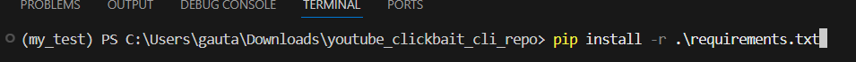
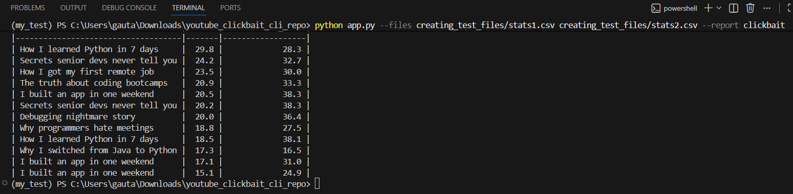
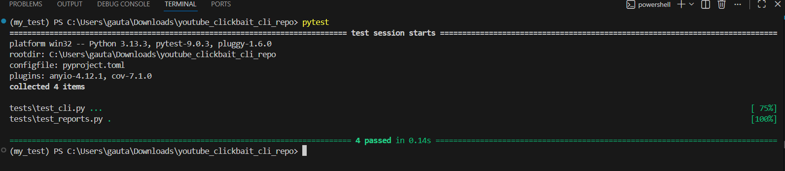
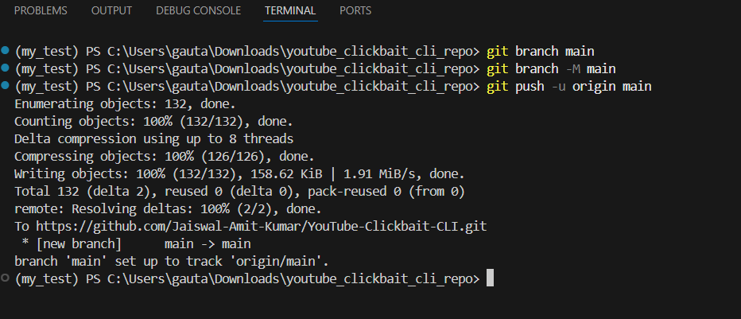

# YouTube Clickbait CLI

Production-ready Python CLI application for processing one or more CSV files with YouTube video metrics and generating console reports.

This project was built to match the provided technical specification exactly.

---

## Features

* Accepts one or multiple CSV files via `--files`
* Selects report type via `--report`
* Implemented report: `clickbait`
* Outputs formatted table to the console
* Validates missing files and unknown reports
* Modular architecture for adding future reports
* Covered with `pytest` tests
* Works on Windows / VS Code / PowerShell / CMD

---

## Clickbait Report Rules

A video is included when:

* `ctr > 15`
* `retention_rate < 40`

Output columns:

* `title`
* `ctr`
* `retention_rate`

Sorting:

* CTR descending

---

## Project Structure

```text
project/
├── app.py
├── requirements.txt
├── requirements-dev.txt
├── README.md
├── youtube_clickbait/
│   ├── __init__.py
│   ├── cli.py
│   ├── csv_reader.py
│   ├── models.py
│   └── reports.py
└── tests/
    ├── test_cli.py
    └── test_reports.py
```

---

## Installation

```bash
pip install -r requirements-dev.txt
```

Install the package in editable mode (recommended for running tests):

```bash
pip install -e .
```

---

## Usage

Single file:

```bash
python app.py --files stats1.csv --report clickbait
```

Multiple files:

```bash
python app.py --files stats1.csv stats2.csv --report clickbait
```

Windows absolute path example:

```bash
python app.py --files C:\\Users\\YourName\\Desktop\\stats1.csv --report clickbait
```

---

## CSV Format

Input files must contain headers:

```csv
title,ctr,retention_rate,views,likes,avg_watch_time
```

Example row:

```csv
I quit IT and became a farmer,18.2,35,45200,1240,4.2
```

---

## Example Output

```text
| title                              |   ctr |   retention_rate |
|------------------------------------|-------|------------------|
| The secret that team leaders hide  |  25.0 |             22.0 |
| How I slept for 4 hours...         |  22.5 |             28.0 |
| I quit IT and became a farmer      |  18.2 |             35.0 |
```

---

## Running Tests

```bash
pytest
```

Coverage:

```bash
pytest --cov=youtube_clickbait
```

If imports fail on Windows, run:

```bash
pip install -e .
```

---

## Architecture Notes

Reports are registered in `REPORTS` dictionary inside `reports.py`.

To add a new report:

1. Create a new class inheriting `BaseReport`
2. Implement `build()`
3. Register it in `REPORTS`

No CLI changes required.

---

## Error Handling

Examples:

Unknown report:

```text
Unknown report: xyz
```

Missing file:

```text
File not found: stats1.csv
```

---

## Packaging

This repository includes `pyproject.toml` so the local package can be installed cleanly for development and testing.

## Tech Stack

* Python 3.10+
* Standard library (`argparse`, `csv`, `pathlib`, `sys`)
* `tabulate` for console tables
* `pytest` for tests

---

## Example Run

Installing all the requirenments from requirenments.txt file:



CLI report output:



## Tests

All tests passing:



## Pushing task projects to github



# GitHub Commands

## Initialize repository:

**git init**

## Add files:

**git add .**

## Create first commit:

**git commit -m "Initial commit"**

## Add remote repository:

**git remote add origin https://github.com/yourusername/youtube-clickbait-cli.git**

## Push to GitHub:

**git branch -M main**
**git push -u origin main**

## Update after changes:

**git add .**
git commit -m "Update project"
git push -u origin main


## Notes for Reviewer

The solution prioritizes:

* clean structure
* readability
* maintainability
* exact compliance with task requirements
* easy future extension
